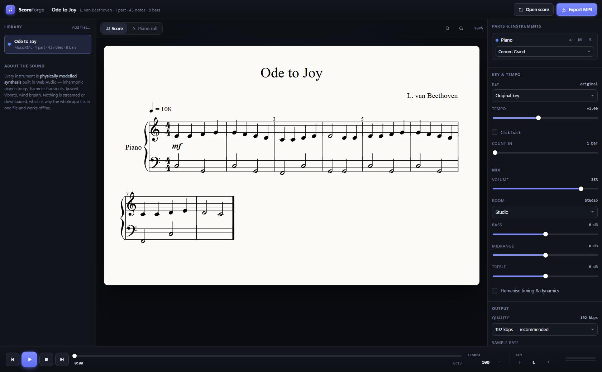
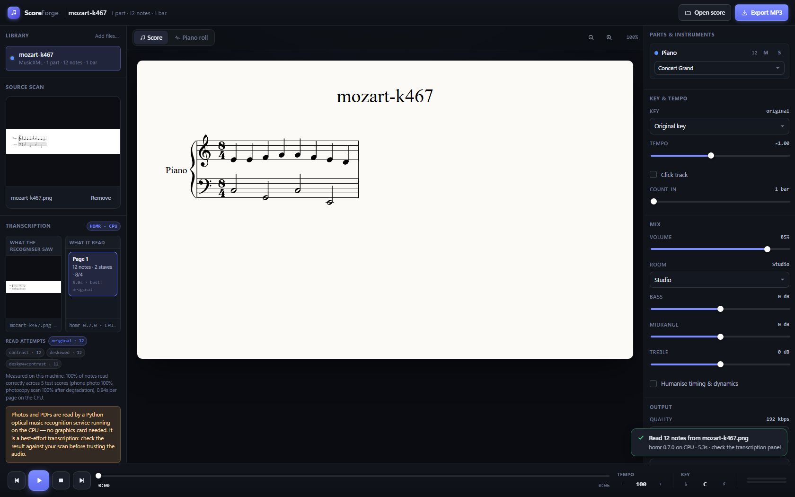
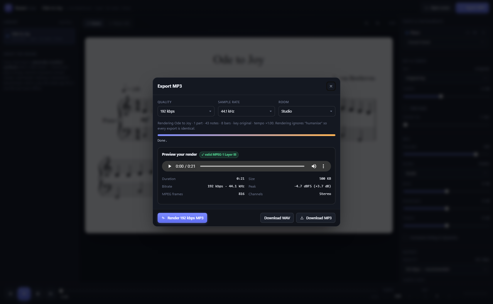
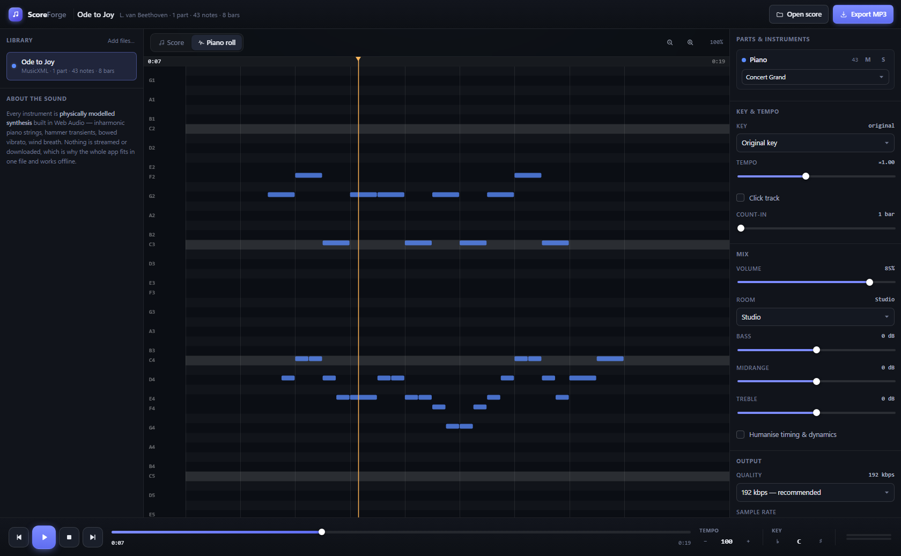

# ScoreForge

Sheet music to MP3, in the browser, in one file.

Open `index.html` and drop in a MusicXML, MuseScore or MIDI file. Pick a key,
tempo and instrument, press space, and it plays. Exporting gives you an MP3 that
you can listen to in the page before you download it.

Photos and PDFs work too. A local Python service reads the notes off them with
optical music recognition and hands back a score you can edit, transpose and
export like any other. It runs on the CPU, so there is no graphics card
requirement.

`index.html` is the build output: 1.7 MB with the notation engine, MP3
encoder, zip reader and 21 instruments inlined. It runs from `file://`.



The Transcription panel puts the image the recogniser was given next to what it
read, so you can check it against the original.



## Running it

Chrome, Edge, Firefox or Safari.

1. Drop a score on the page, or use **Choose files**.
2. Set key and tempo in the inspector.
3. Pick an instrument. Per part, if there is more than one.
4. Space plays.
5. **Export MP3** renders the audio, plays it back through the page, and unlocks
   the download when it is done.



### File formats

| Format | Extensions | Notes |
|---|---|---|
| MusicXML | `.musicxml` `.xml` `.mxl` | MuseScore, Sibelius, Dorico, Finale, Noteflight. Zipped `.mxl` is unpacked automatically. |
| MuseScore | `.mscz` `.mscx` | Native project files. |
| MIDI | `.mid` `.midi` `.kar` `.rmi` | Format 0/1/2, running status, SMPTE division, tempo and key meta events. |
| Scan | `.png` `.jpg` `.jpeg` `.webp` `.gif` `.bmp` `.pdf` | Read by the Python service (see below). Each PDF page becomes its own score. |

Scans need that service running. Without it the page still works: MusicXML and
MIDI parse locally, and a scan is kept as a reference image with the panel saying
why.

MuseScore projects and MIDI have no notation source, so they show as a piano roll.



### Keyboard

| Key | Action |
|---|---|
| `Space` | Play / pause |
| `←` `→` | Seek 3 s (`Shift` = 10 s) |
| `Home` | Back to start |
| `E` | Export MP3 |

## Reading scans

The recogniser lives in `backend/`. Start it with:

```powershell
python backend/app.py
```

It listens on http://127.0.0.1:8000 and also serves `index.html`, so
http://127.0.0.1:8000/ is the easiest place to work. Opening the HTML file
directly works too; the page points at 127.0.0.1:8000 only when it needs to
transcribe something.

The first run downloads about 37 MB of ONNX weights.

Given a scan, the service decodes it (respecting EXIF rotation) or rasterises
each PDF page, builds four renderings of the page (as-is, contrast lifted,
deskewed, and both), reads each one, and keeps whichever produced the most notes.
The result is MusicXML, which is what the page already parses, so a scan enters
the same notation, playback and export path as a file exported from MuseScore.

### What it gets wrong

The accuracy figures come from engraving known MusicXML to PNG, reading it back,
and comparing note by note against what was actually printed.

| Condition | Notes | Precision | Recall | F1 |
|---|---|---|---|---|
| Printed score | 75 | 100.0% | 100.0% | 100.0% |
| Phone photo (1.4° tilt, uneven lighting, noise, JPEG 62) | 75 | 100.0% | 100.0% | 100.0% |
| Photocopy scan (low contrast, blur, adaptive threshold) | 75 | 100.0% | 100.0% | 100.0% |

About 0.9 s per page on the CPU. Duration accuracy is 100% on printed and
photographed scores, 92% on photocopies. To reproduce:

```powershell
python tools/score_omr.py --write fixtures/accuracy.json
```

The page fetches those numbers from the service and shows them in the
Transcription panel.

The fixtures are engraved music, some of them synthetically degraded. Handwriting,
curved book pages, very low contrast and dense polyphony are not in the set and
are harder. Read the result against your scan rather than trusting it.

The time signature is taken from whatever bar lines the recogniser can see, so a
page engraved without interior barlines can come back as one long bar instead of
4/4. Durations are unaffected.

## Instruments

There are two kinds, and both are in the same per-part list.

**Synthesised** (22 instruments, the default). No audio samples. A convincing grand
piano as samples runs to tens of megabytes, which would break the one-file idea.
Each instrument is synthesis written directly against the Web Audio API instead.

Concert Grand follows the physics of a real piano: inharmonic partials
`f_n = n·f₀·√(1+B·n²)` with a stiffness coefficient that rises in the bass,
per-partial decay times so the upper partials die before the fundamental, three
detuned unison strings per note for the slow beating, a filtered-noise hammer
transient scaled by velocity, brightness that tracks pitch and velocity, body
resonance that glues a chord into one instrument, and dampers that lift under
the sustain pedal.

The others use the same idea: tuned-bar inharmonic ratios for bells and mallets,
Karplus–Strong-style excitation for plucked strings, formant shaping with vibrato
that ramps in for bowed and vocal sounds, breath noise for the winds, and
drawbar-style additive synthesis for the organ. None of these needs a network
connection, and the whole app still fits in one file.

**Recorded** (50 instruments, a `pack/` directory of ~121 MB). Real sampled
instruments, in six picker groups: piano, organ, plucked & struck, guitar & bass,
winds & reed, and synth.

Every one of them is a [FreePats][freepats] bank. Forty-nine are CC0; the FSS
steel-string acoustic guitar is GPL-3.0-or-later with the FreePats sound-sample
exception, so that one pack's terms are reproduced in NOTICE.md and in the app
rather than being averaged into a blanket "FreePats is CC0" that would be false
for it.

Their filenames carry no pitch — they are `1_01.wav` and so on — so the builder
reads each bank's own SFZ for the key map, `pitch_keycenter`, `tune` and
author-chosen loop points rather than guessing from names.
`tools/fetch-freepats.mjs` fetches and extracts the banks;
`tools/freepats-banks.mjs` is the table of which bank is which instrument;
`tools/list-recorded.mjs` reports what each one actually contains.

Some banks are sampled on every key they cover and some are not — a key with no
take of its own plays the nearest one, shifted, so no key is ever silent, but
**how far** that shift gets varies a lot and is worth knowing before you reach
for an instrument. `node tools/list-recorded.mjs` prints the worst shift per
bank. Two extremes: the jaw harp is sampled on all 48 of its keys and never
shifts at all, while the button accordion claims the whole MIDI range but has 16
real takes, so its extremes are transposed by nearly four octaves.

These need the pack fetched once, so they are **not** available from a page
opened as a `file://` URL — pick one there and it falls back to the modelled
instrument of the same family, and Settings says so. Over http the backend
serves `pack/` from its own origin.

**Fetching and decoding are separate.** The whole pack is fetched once, in
compressed form, at start-up. The decoded PCM is not: that much MP3 is several
gigabytes of 32-bit float, which no browser tab can be asked to hold before
playing the first note. So a pack's PCM is decoded the first time an instrument
that needs it is selected — only the keys the piece actually uses — and the
decoded cache keeps a 1 GB budget, dropping least-recently-used takes. An
instrument with a note currently sounding is never dropped. Picking a single very
large instrument may take the cache over the budget rather than refuse to play it;
`node tools/check-decode-budget.mjs` measures that this actually happens.

Rebuild the pack with `npm run pack` (see [Development](#development)). The
builder does nothing to the recordings — no trim, no normalisation, no marker,
no truncation — so three things are worth knowing before changing it:

- **Every file is its source WAV, re-encoded.** Nothing is written into the audio
  that the FreePats banks did not contain.
  `node tools/check-pack-is-unprocessed.mjs` decodes every shipped file and
  compares it against the WAV it came from, and fails if a take's level, length,
  channel count or stereo width has moved.
- **Chrome does not strip LAME's encoder delay.** An encoded note arrives about
  1105 samples (25 ms) late — and 1524 for stereo at 96 kbps, so it is not a
  constant. The pack therefore prepends nothing at all; the sampler finds the
  first sound in each decoded buffer at decode time and starts there, which
  absorbs the encoder delay and the recording's own leading silence together.
  `node tools/check-codec-delay.mjs` measures the delay.
- **The recordings are not recorded at comparable levels** — the piano sits 30 dB
  under the tubular bells. Each take carries a gain in the manifest that puts its
  family at a common peak, and the sampler applies it at playback. That is the
  whole of the mix balance: it is a number, not an edit to the recording.
- **Keeping the takes in full costs pack size.** It is about a fifth more than
  truncating them to 4 s did. `node tools/make-pack.mjs --bitrate 128` trades
  quality back for size without touching anything else.

[freepats]: https://freepats.zenvoid.org/ (sample banks, CC0 and GPL-3+exception)

## Installing on Linux

Needs Python 3.12 to 3.15. Everything else comes from pip. No GPU, no CUDA.
See [Python](#python) below for the version this needs and what the installer
does about it.

Node is needed only to build the single file, and any Node from 18 works. The
browser-driven checks (`npm test`, `npm run test:suites`) additionally need
Node 22, because the harness talks to Chrome over the global `WebSocket` — if you
are on 18, the build succeeds and the tests explain themselves rather than
throwing.

```bash
git clone https://github.com/ScottYates/ScoreForge.git
cd ScoreForge
./deploy/release.sh
```

That is the three commands below, with the failure modes handled:

```bash
npm install && npm run build     # writes index.html
sudo ./deploy/install.sh
```

`release.sh` checks Node is new enough, confirms `index.html` actually appeared
before handing over to the installer, and runs npm as you — only the installer is
escalated with sudo, so `node_modules` never ends up owned by root.

| Override | Effect |
|---|---|
| `SKIP_NPM=1` | only run the installer |
| `SKIP_INSTALL=1` | only build |
| `NPM_INSTALL=1` | `npm install` instead of `npm ci` |

Run either script as a program, not with `source`. They create users, write under
`/opt` and drive systemd, so sourcing one would do all of that inside your
interactive shell and close it on the first error — both refuse if you try.

That installs to `/opt/scoreforge`, creates an unprivileged `scoreforge` system
user, installs the Python dependencies, downloads the ONNX weights, and starts
two systemd services. `index.html` is copied there too, so it works
straight off disk with no server at all.

```bash
systemctl status scoreforge scoreforge-web
curl -s http://127.0.0.1:8000/api/health
```

The installer finishes by transcribing a fixture through the running backend and
printing the note count, so a successful run means recognition was actually
exercised, not just imported.

Then open <http://127.0.0.1:8000/>.

### Python

Needs Python 3.12 to 3.15 — `requirements.txt` pins numpy 2.5.3, which requires
3.12 or newer.

**The installer does not change the Python your machine already has.** It never
invokes the system package manager, writes nothing to `/usr/bin` or
`/usr/local/bin`, and edits no shell profile. It works like this:

1. Use an interpreter already on `PATH` if one is in range. If several are, the
   versions it skipped are listed with the reason.
2. Otherwise fetch a private one under `/opt/python`, along with `uv` itself if
   needed — also under `/opt/python`, with profile editing switched off.
3. Point it somewhere else yourself with `PYTHON=/path/to/python3.13`.

The interpreter that ends up being used is printed at the end, and so is the
machine's own `python3` — re-read after the install and compared with what it
was before. If it moved, the install fails.

Two switches, if you would rather it touched nothing:

```bash
sudo SKIP_PYTHON_FETCH=1 ./deploy/install.sh   # never download a Python
sudo SKIP_WEB=1 ./deploy/install.sh             # backend only, no page service
```

The install does **not** transcribe a test score by default. That check runs CPU
inference, which is minutes per fixture, and it makes an install that has
nothing else to do take that long. It is also the only part of the install that
proves homr can actually *read* a score rather than merely import — the health
check covers the rest — so it is skipped rather than deleted:

```bash
sudo SKIP_SMOKE=0 ./deploy/install.sh   # transcribe a fixture end to end
```

Worth doing on a first install on a new machine, and after changing anything in
`backend/requirements.txt`. The install's summary says which of the two it did,
so a skipped check is never silent.

`deploy/release.sh` is also the upgrade path: pull, rebuild, install, in one
step. Or run `deploy/install.sh` on its own — it leaves
`/etc/scoreforge/scoreforge.env` alone (backing it up to `.bak`).

### The two services

| Unit | Serves | Default port |
|---|---|---|
| `scoreforge.service` | The API, and the page at `/` | 8000 |
| `scoreforge-web.service` | The page alone, as a static file | 8080 |

```bash
systemctl restart scoreforge scoreforge-web
journalctl -u scoreforge -f
journalctl -u scoreforge-web -f
```

The page does not depend on the backend being up. MusicXML, MuseScore and MIDI
are read in the browser either way, and a scan with no backend behind it is kept
as a reference image instead of being transcribed — so the web service is not
ordered after `scoreforge.service`, and it stays up when the backend is down.

Only `index.html` is served. The page lives in `/opt/scoreforge/www`, not in
`/opt/scoreforge`, so the backend source and the test fixtures are not reachable
over HTTP. The installer checks this at the end and fails if it ever stops being
true.

Config lives in `/etc/scoreforge/scoreforge.env`, copied there from
`deploy/scoreforge.env.example`. The defaults are right for a local install.

The service runs as `scoreforge` with a read-only filesystem. The weights are
fetched during install so it never needs to write anywhere at runtime.

### Changing the ports

Two settings, both in `/etc/scoreforge/scoreforge.env`:

```bash
SCOREFORGE_PORT=9100    # the backend, and the page it serves at /
SCOREFORGE_WEB_PORT=3000 # the page, when scoreforge-web serves it separately
```

`SCOREFORGE_WEB_PORT` is the port `scoreforge-web.service` listens on, defaulting
to 8080. It also decides which page origins the backend will accept, so setting
it once covers both halves. Ports 8080 and 8081 are always allowed regardless.

After editing, restart both:

```bash
systemctl restart scoreforge scoreforge-web
```

### Serving the page somewhere else entirely

The installer already runs `scoreforge-web.service`, which is a plain static
file server on `SCOREFORGE_WEB_PORT`. To serve it yourself instead — behind
nginx, say — stop that unit and point the page at the backend with a query
parameter:

```
http://127.0.0.1:3000/?api=http://127.0.0.1:9100
```

That applies to the page load only and is not remembered. The backend also has
to allow the page's origin, which is what `SCOREFORGE_WEB_PORT` and
`SCOREFORGE_ALLOWED_ORIGINS` are for.

On a machine without Node, skip the build entirely: copy `index.html` to the
server and open it from disk.

### Behind a reverse proxy

The service binds loopback and has no authentication. That is deliberate, and it
is why nothing should be pointed at it directly. To reach it over a network, put
TLS and an access check in front:

```nginx
server {
    listen 443 ssl;
    server_name music.example.com;

    client_max_body_size 40m;

    location / {
        proxy_pass http://127.0.0.1:8000;
        proxy_set_header Host $host;
    }
}
```

Add `music.example.com` to both `SCOREFORGE_ALLOWED_HOSTS` and
`SCOREFORGE_ALLOWED_ORIGINS` in the env file, or the browser will refuse the
page's API calls.

### Page and API on separate subdomains

The two do not have to share a hostname or a port. Put the page on one subdomain
and the API on another, and the page tells the backend where to find it with
`?api=`:

```
page   https://music.example.com/
API    https://api.music.example.com
```

```nginx
# the page
server {
    listen 443 ssl;
    server_name music.example.com;
    root /opt/scoreforge/www;
}

# the API
server {
    listen 443 ssl;
    server_name api.music.example.com;

    client_max_body_size 40m;

    location / {
        proxy_pass http://127.0.0.1:8000;
        proxy_set_header Host $host;
    }
}
```

```bash
SCOREFORGE_PORT=8000                       # still loopback, behind the proxy
SCOREFORGE_ALLOWED_ORIGINS=https://music.example.com
SCOREFORGE_ALLOWED_HOSTS=api.music.example.com
```

Two things are easy to get backwards here. `SCOREFORGE_ALLOWED_ORIGINS` takes the
**page's** origin, because that is what the browser sends; `SCOREFORGE_ALLOWED_HOSTS`
takes the **API's** hostname, because that is the Host header nginx forwards. Then
open the page with `?api=https://api.music.example.com` on every URL you hand
out — it is not remembered between loads.

### What the service exposes

Only the page at `/` and the `/api/` routes. The project directory is not served,
so the source tree, `.git/` and any scores you keep alongside it are not
reachable. Requests are checked against an allow-list of origins and host
headers, so a website you visit cannot drive your local backend, and a DNS
rebind cannot either.

## Development

```bash
npm install
npm run build      # -> index.html (minified)
npm run dev        # -> index.html (readable)
npm test           # build + headless self-test + screenshot
npm run test:suites   # the four module suites
npm run serve      # start the recognition backend
npm run test:omr   # recogniser accuracy, all three conditions
```

### Layout

```
src/
  index.html            shell + icon sprite (placeholders: {{CSS}} {{VENDOR}} {{APP}})
  styles/app.css        design system
  js/
    main.js             bootstrap, demo score, self-test harness
    score/model.js      score model, Timing, resolveScore, key/pitch math
    io/musicxml.js      MusicXML  -> score
    io/smf.js           Standard MIDI File -> score
    io/mscx.js          MuseScore project -> score
    io/files.js         file intake, zip, type sniffing
    io/omr.js           recognition backend client
    audio/instruments.js the 21 voices
    audio/engine.js     lookahead scheduler (live) + scheduleAll (offline)
    audio/fx.js         procedural convolution reverb, EQ, compressor
    audio/mp3.js        OfflineAudioContext render -> LAME -> MP3/WAV
    audio/gm.js         General MIDI program -> instrument id
    render/notation.js  OpenSheetMusicDisplay wrapper + playback cursor
    render/roll.js      piano roll canvas
    ui/                 controller, DOM helpers
backend/
  app.py                FastAPI: /api/omr, /api/health, /api/accuracy, static
  omr_engine.py         homr wrapper: CPU config, variants, MusicXML summary
  preprocess.py         decode / PDF rasterise / deskew / contrast / resize
  requirements.txt
tools/
  build.mjs             esbuild bundle -> single HTML
  cdp.mjs               headless-Chrome harness (no npm deps)
  verify.mjs            build + self-test + screenshot
  run-suites.mjs        the module suites, one verdict
  make-pack.mjs         build pack/ from the sample caches
  freepats-banks.mjs     which FreePats bank is which instrument, and where it goes
  fetch-freepats.mjs     scrape the FreePats catalogue, download and extract the banks
  survey-freepats.mjs    what is actually in a downloaded bank
  check-pack-credits.mjs  do NOTICE.md and the app still credit what the pack ships
  check-decode-budget.mjs does the decoded-PCM cache stay inside its budget
  check-loop-seam.mjs   does a held recorded note gate at its loop point
  check-codec-delay.mjs measure MP3 encode+decode latency
  check-sampler-audio.mjs  render the real pack and measure it
  check-recording-fidelity.mjs is a take still the recording it was cut from
  check-pack-is-unprocessed.mjs is the pack still just the recordings
  check-no-unguarded-deletes.mjs nothing deletes outside guard.mjs / guard.py
  lib/guard.mjs        the only file allowed to delete anything (JS side)
  guard.py             the same rule for the Python backend
  check-cursor.mjs      is the playback cursor the colour we chose, where it should be
  check-transport.mjs   press Play / Stop / Back-to-start and read the UI back
  check-piano-voice.mjs measure the synth piano against the recorded one
  drive-omr.mjs         drives the built page against a live backend
  drive-transport.mjs   one transport scenario, optionally with a screenshot
  check-omr-jobs.py     the job API against a live backend
  check-omr-progress.py progress plumbing, without loading the model
  watch-omr-progress.py print every progress tick of one real scan
  list-recorded.mjs    what is actually in each recorded pack, and how far it shifts
  lib/wav.mjs           RIFF/WAVE reader for the pack builder
  lib/sfz.mjs           SFZ parser: key map, keycentre, tune and loop points
  lib/pitch.mjs         a note name to a MIDI number, for the SFZ key map
  lib/credits.mjs       render the NOTICE credits block from the manifest
  lib/lame.mjs          the app's own lamejs, loaded into Node
  make-fixtures.mjs     render ground-truth score images + gt.json
  score-render.html     engraves one known fixture for make-fixtures
  score_omr.py          recogniser accuracy suite
fixtures/               ground-truth images + accuracy.json
pack/                   recorded-instrument samples + manifest.json
tests/                  per-module test pages, all runnable headless
docs/screenshots/
```

### Never delete anything you did not create

Two rules, both enforced rather than remembered:

- **Never delete anything this repository did not create.**
- **Never delete anything outside the working folder.**

`tools/lib/guard.mjs` and `backend/guard.py` are the only files in the project
allowed to call a delete API, and each refuses a directory that does not carry a
`.scoreforge-owned` marker written at the moment it was created, or that resolves
outside the repository. `node tools/check-no-unguarded-deletes.mjs` scans
`tools/` and `backend/` for eight delete call shapes across JS, Python and
PowerShell, then exercises both guards' refusals for real — outside the workspace,
the workspace itself, a shared-prefix sibling, an unmarked directory, a file
outside any claimed tree — because a guard that has never been seen to refuse is
only known to exist.

This is not ceremony. The pack builder once cleared its own output directory,
which also held a hand-written page; the browser harness kept its profile in a
temp directory and deleted it there; the OMR engine used `tempfile` for scratch on
every request. All three were outside the working folder, or wider than what the
tool had made, and none of them errored.

### Testing

`npm test` builds the single file and opens it in a headless browser with
`?selftest`, which parses a known score, parses a hand-built MIDI byte fixture
(running status, tempo, key, note pairs), checks the timing arithmetic and
transposition, renders a chord on all 21 instruments and asserts none is silent
or clipping, renders the demo score offline and asserts it beats real time,
encodes MP3 and walks the MPEG frame headers to confirm the file really is
MPEG-1 Layer III at the requested bitrate, and renders real notation and counts
the glyph paths.

A module suite runs the same way, given an absolute `file://` URL:

```bash
node tools/cdp.mjs --url "file:///$(pwd)/tests/musicxml-test.html" \
  --wait "window.__DONE__===true" --timeout 60000 \
  --eval "document.getElementById('out').textContent"
```

In PowerShell use `file:///$PWD/tests/musicxml-test.html`. `npm run test:suites`
runs all six at once: `musicxml-test.html` (179 assertions), `smf-test.html`
(97), `instruments-test.html` (250 checks), `mscx-test.html` (125),
`omr-test.html` (33) and `sampler-test.html` (31). Each publishes a
`{passed, failed, fatal}` verdict; a suite that publishes none is treated as a
failure rather than a pass.

`sampler-test.html` covers the recorded instruments with synthetic buffers: that
a note makes sound, that its attack lands at the time it was scheduled, that a
pitch with no sample falls back instead of going quiet, that a release scheduled
*ahead* of the note still lets it sustain, and that an unloaded pack is refused
rather than returning a voice that cannot sound. It is mutation-checked —
deleting the `src.start()` in `noteOn` turns it red, and restoring the old
`src.loop = false` on release turns it red.

Two checks need something the fast suites do not:

```bash
node tools/check-sampler-audio.mjs   # the real pack, in a browser, measured
node tools/check-codec-delay.mjs     # how late an encoded note arrives
python tools/check-omr-jobs.py fixtures/tiny.png fixtures/ode.pdf
python tools/check-omr-progress.py    # no backend needed
python tools/watch-omr-progress.py    # prints every tick of a real scan
node tools/drive-omr.mjs run   fixtures/tiny.png
node tools/drive-omr.mjs abort fixtures/ode.pdf
node tools/drive-transport.mjs finish --shot /tmp/tp.png   # one scenario, pictured
```

`check-transport.mjs` presses the real transport buttons against the built page
and reads back what a person would see: the time readout, the scrub bar's width,
the play icon, and the cursor's actual place on the page. It encodes one rule —
*sitting at the start with nothing playing looks like a fresh load, so there is
no cursor* — and applies it to every state the buttons can reach. The module
suites stub the audio engine and cannot see any of this; it is what found the
piece parking at the last bar after it finished, and Stop leaving a cursor on
the first note that was not there before you pressed anything.

`check-sampler-audio.mjs` serves the repository over http, loads the actual
131 MB pack, renders every instrument offline and reports its peak, how late its
attack lands and whether a held note outlives its sample — then renders the same
chord through the app's own `renderToBuffer` export path. The fast suite uses
synthetic buffers and cannot tell you whether the encoded pack is audible; this
can, and it is what found the two facts above about codec delay and levels.

`check-recording-fidelity.mjs` asks the other question: is the pack still the
instrument that was recorded? It decodes shipped takes and measures what is in
them against what the manifest says they should contain — the stereo width of
the recording it was cut from, and the pitch the take was filed under. A player
check cannot catch that class of fault, because folding the stereo, sharing one
rate between two takes recorded a tone apart, or looping a piano all leave the
sampler working perfectly on samples that no longer sound like themselves.

`drive-omr` needs the backend running (`python backend/app.py`) and drives the
built page in a headless browser. It watches the progress card the way a person
would, saves the MusicXML and reads the bytes back, and on abort checks what the
*backend* says the job became — a UI that merely stopped watching scores the same
as one that actually freed the CPU.

The recogniser suite is separate because it needs the Python environment. It
rejects any fixture whose declared notes disagree with what was rendered, so a
broken fixture cannot be blamed on the recogniser.

CI runs the build and both test layers on every push and pull request.

## Third-party components

Bundled into `index.html`:

| Component | Licence |
|---|---|
| OpenSheetMusicDisplay 2.2 + VexFlow 1.2.93 | MIT / MIT |
| lamejs 1.2.1 (MP3 encoder) | LGPL-3.0 |
| fflate 0.8 (zip) | MIT |

Installed into `backend/.venv`, not bundled into the page:

| Component | Licence |
|---|---|
| [homr](https://github.com/liebharc/homr) 0.7.0 | AGPL-3.0 |
| onnxruntime 1.30 | MIT |
| rapidocr (title detection) | Apache-2.0 |
| opencv-python-headless 5.0 | Apache-2.0 |
| pypdfium2 5.14 | Apache-2.0 / PDFium (BSD-3) |

homr is AGPL-3.0. That is fine for a service you run on your own machine. If you
expose the backend to other users over a network, the AGPL terms reach it. The
page itself stays MIT/LGPL either way, since it never links against homr.

Music glyphs are vector paths from VexFlow's built-in font data, so no webfont
is fetched at runtime.

## Limitations

- Scans need the Python service. MusicXML, MuseScore and MIDI never do.
- The recogniser reads engraved music. It is not a handwriting reader.
- No MIDI from audio.
- Playback and export share a code path, but `OfflineAudioContext` output is
  bit-identical only because "humanise" is forced off for renders.
- Very long scores render the notation view progressively as you scroll.
- The recorded instruments need the page to be served over http. From a `file://`
  page the pack cannot be fetched and the `Recorded` instruments fall back to
  their modelled equivalents.
- The recorded pack has one dynamic layer per instrument, so dynamics come from
  the sampler's gain curve rather than from velocity-layered samples. The
  upright piano is the exception: its bank ships two hammers per key and
  velocity picks between them, so a crescendo changes the timbre and not only
  the loudness. Banks that record one layer keep round-robin alternation, which
  is all the variation there is.
- The piano banks do not loop. A struck string has to decay, and the FreePats
  SFZ does declare loop points for it; honouring them turned every note held
  past a few seconds into a drone that jumped back up to full level. Its takes
  are also kept to 10 s rather than the 4 s the other families get, because an
  A2 on that bank is still audible at four.
- The two FM pianos are labelled *synthesised* and sit with the synths. FreePats
  calls them "FM Synthesized Piano"; calling them recorded put a keyboard that
  was never played next to the ones that were.
- A key with no recording of its own is played by resampling its nearest
  neighbour, up to three semitones. Marimba and xylophone have gaps wide enough
  to need the full three, so those keys are a resample rather than a real take.